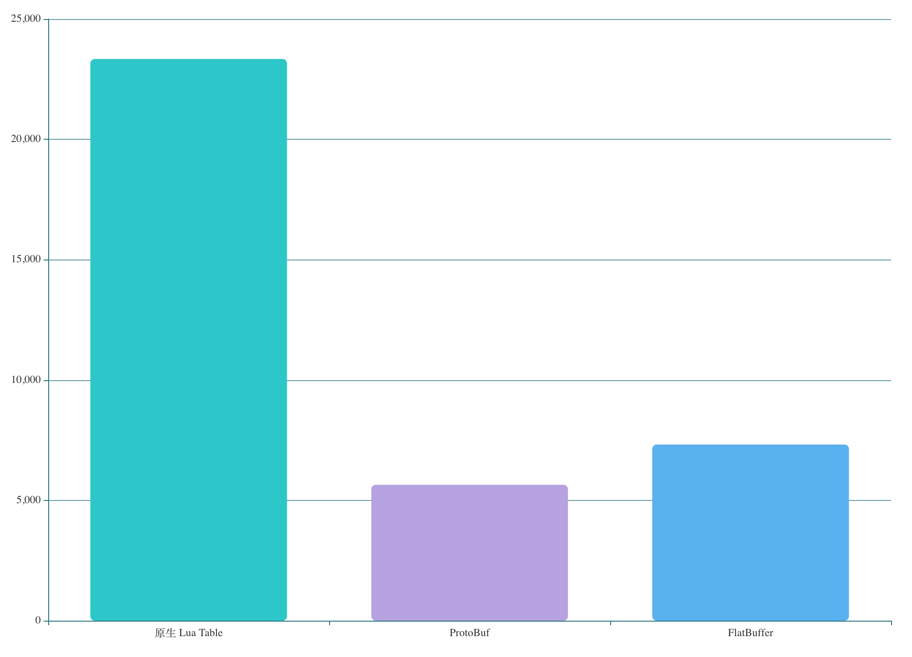
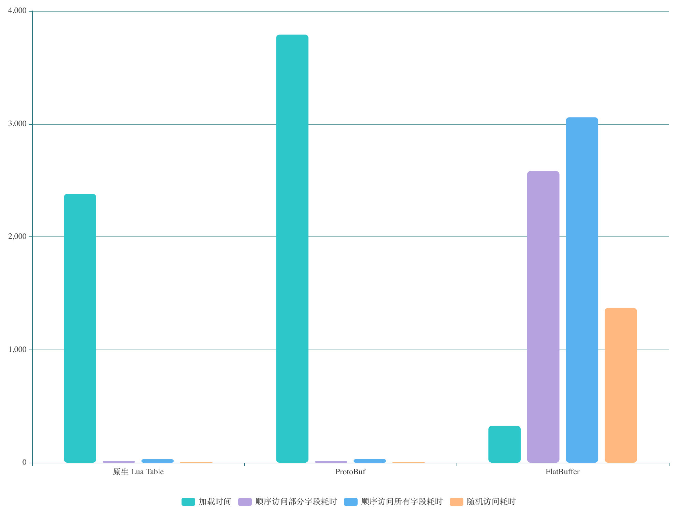
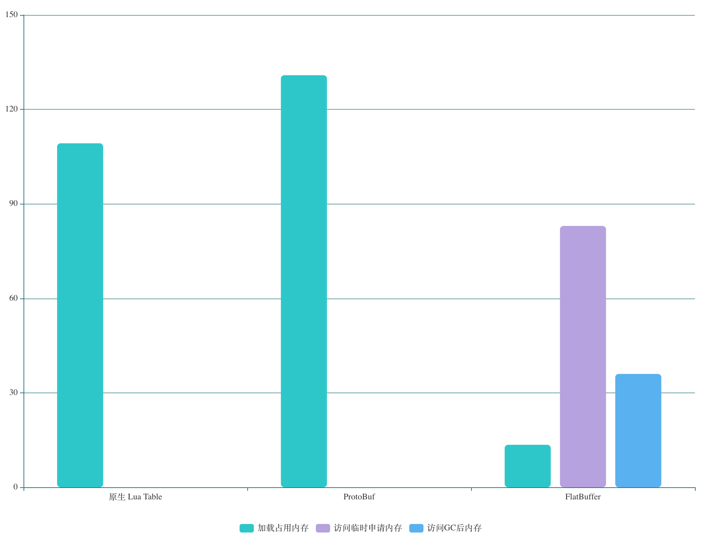
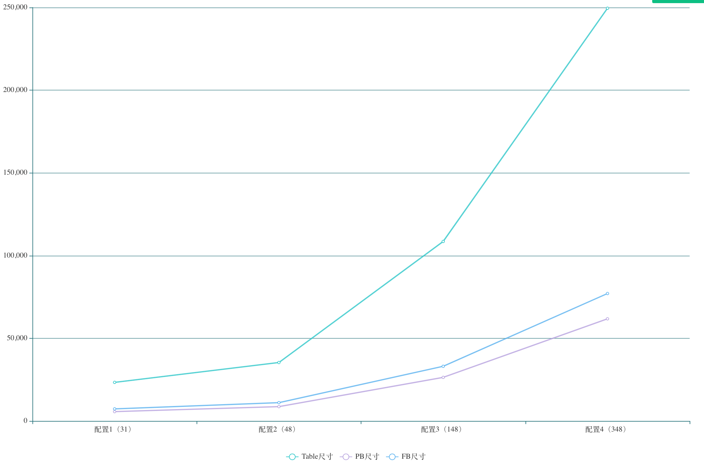
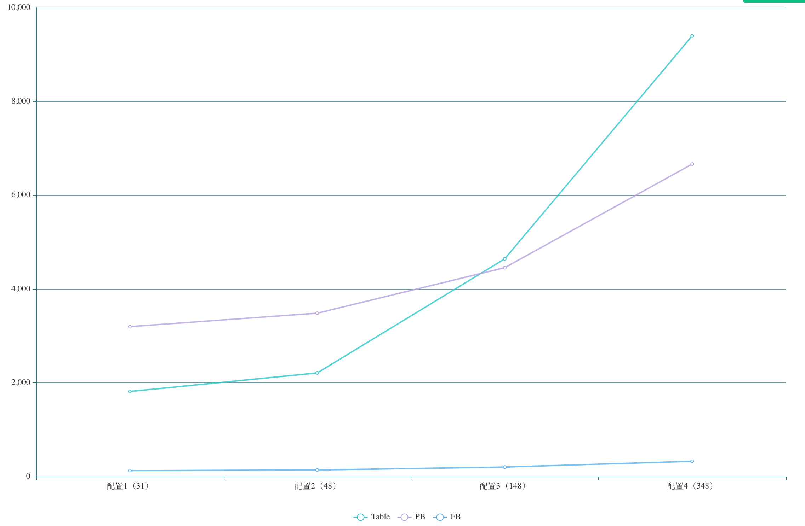
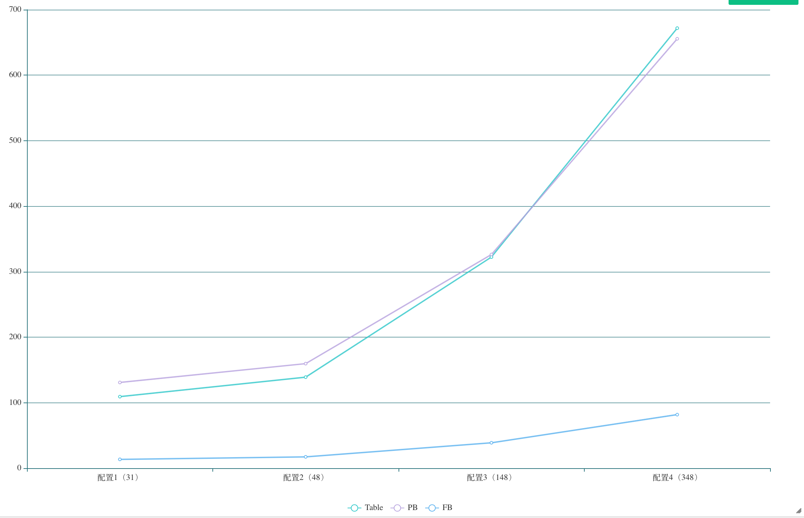
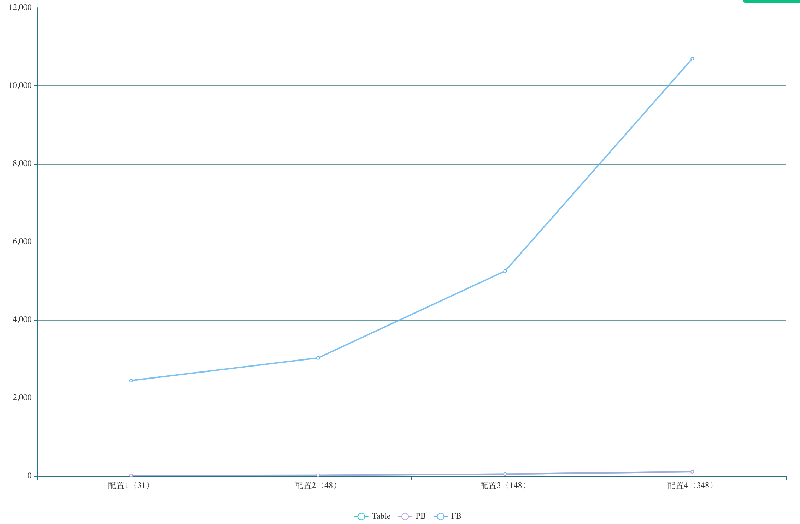
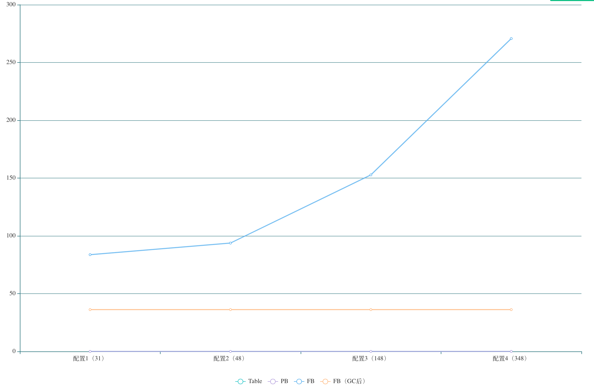

# FlatBuffer 测试

- 使用版本：v1.12.0
- 地址：https://github.com/google/flatbuffers/releases/tag/v1.12.0

## 一、使用步骤

1. 编写fbs文件（flatbuffer schema）

2. 使用`flatc`生成对应`read`、`write`脚本

    ```
    flatc --lua monster.fbs
    ```

3. 手写生成二进制代码，或通过 json 转成二进制文件

    手写二进制代码见`writetest.lua`

    json 转换命令：

    ```
    flatc -b monster.fbs monster.json
    ```

4. 加载二进制文件，读取对应值

    读取代码见`readtest.lua`

## 二、注意事项

### Schema

- 为了兼容，FlatBuffer `table`不允许删除字段，你可以将不需要的字段设置为`deprecated`

### Reading & Writing

- `struct`可以内联创建，`struct`是多个标量简单的组合，始终以内联方式存储

    ```
    monster.AddPos(builder, vec3.CreateVec3(builder, 1.0, 2.0, 3.0))
    ```

- `table`或其他 objects，不能嵌套创建，如果在`start`、`end`过程中创建，会抛出异常

## 三、数据对比

### 文件尺寸对比



### 耗时对比



### 内存对比



### 尺寸增长折线图



### 加载耗时增长折线图



### 加载占用内存折线图



### 顺序访问部分字段耗时折线图



### 顺序访问部分字段内存折线图



说明：

- Lua：使用 5.3.5

- Protobuf：使用 [lua-protobuf](https://github.com/starwing/lua-protobuf)，protobuf3 语法，构建可以参考该[地址](https://git.code.oa.com/ruihanyang/lua-protobuf-build)

### 总结

1. Lua Table

    优势：
    - 访问速度快
    - 使用 Lua 原生数据结构，工具开发量小，可直接使用

    劣势：
    - 文件尺寸大
    - 文件为明文，不安全
    - 加载耗时高
    - 占用内存高

    改进：
    - 可以尝试将`.lua`文件编译成`.bytes`文件来减小文件大小和一定程度进行加密

2. Protobuf

    优势：
    - 访问速度快
    - 文件尺寸最小

    劣势：
    - 加载耗时高
    - 加载默认占用内存高

3. FlatBuffer

    优势：
    - 加载耗时少
    - 加载占用内存少

    劣势：
    - 访问速度慢
    - 访问需要一定的内存申请
    - 使用习惯不一致，使用方法访问属性，而不是直接使用属性名，需要额外添加代码来解决这个问题

    改进：
    - 通过将常用字段缓存下来，可一定程度上加快字段访问
    - 通过添加额外的`__index`逻辑，可以解决使用习惯不一致问题

-----

总结：可以看到 Lua Table 和 Protobuf 默认都是将所有配置都反序列化加载到内存中，因此它们在默认情况下加载的耗时和占用的内存是非常高的。而 FlatBuffer 只是将二进制数据加载到内存中，访问的时候再反序列化，因此它的加载耗时和内存占用较小，但相比其他两种，访问速度就比较慢了，考虑到游戏一般情况下不会使用配置表中所有字段和内容，频繁访问的字段也可以进行缓存提高访问速度，使用 FlatBuffer 节省的时间和内存就比较可观了。

## 四、工具

### `fbs_gen_lua.py`

使用 fbs 生成对应的 lua 脚本

```sh
python fbs_gen_lua.py FBS_PATH
```

### `table2json.lua`

根据 lua table 生成对应的 json 文件

```sh
lua table2json LUA_TABLE_PATH OUTPUT_PATH
```

### `lua_gen_bin.py`

1. 根据 lua table 生成对应 json
2. 根据 fbs 将 json 转换成 bytes

```sh
python lua_gen_bin.py PATH
```

### `lua2pb.lua`

根据 Proto LuaTable MessageName 生成对应的二进制文件

```sh
lua lua2pb.lua PROTO_PATH LUATABLE_PATH MESSAGE_NAME OUTPUT_PATH
```
